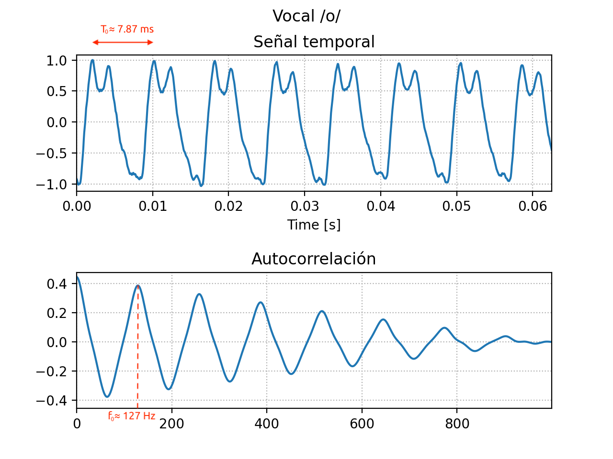
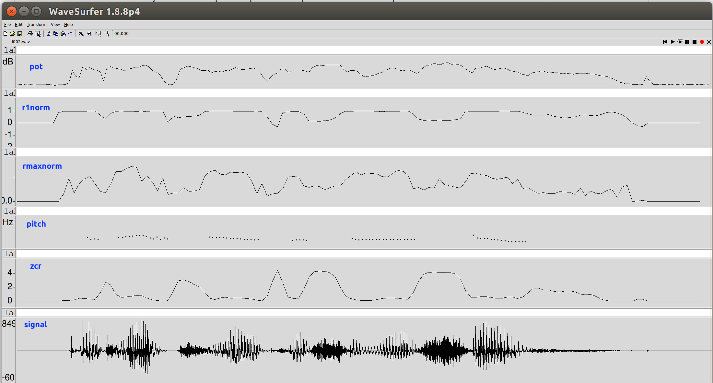
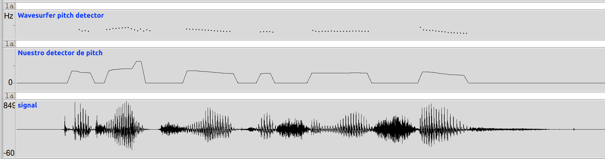
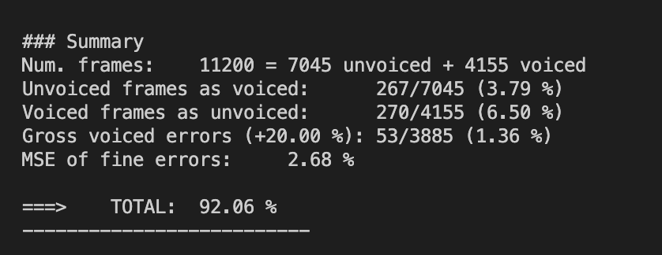
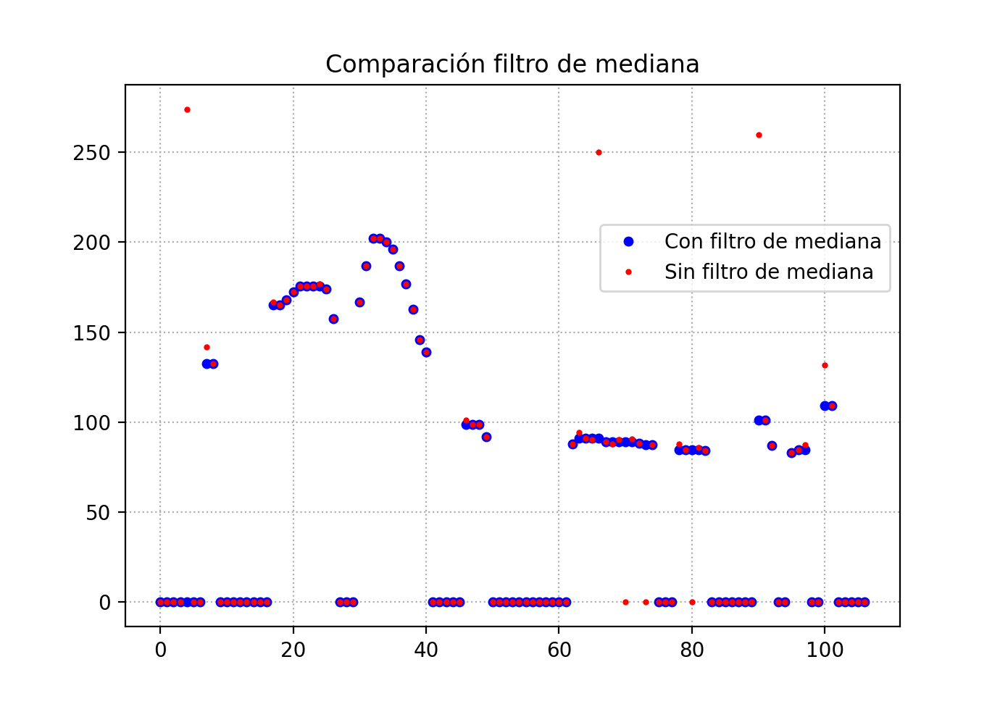

PAV - P3: detección de pitch
============================

Esta práctica se distribuye a través del repositorio GitHub [Práctica 3](https://github.com/albino-pav/P3).
Siga las instrucciones de la [Práctica 2](https://github.com/albino-pav/P2) para realizar un `fork` de la
misma y distribuir copias locales (*clones*) del mismo a los distintos integrantes del grupo de prácticas.

Recuerde realizar el *pull request* al repositorio original una vez completada la práctica.

Ejercicios básicos
------------------

- **Complete el código de los ficheros necesarios para realizar la detección de pitch usando el programa**
  `get_pitch`.

   * **Complete el cálculo de la autocorrelación e inserte a continuación el código correspondiente.**
	   ```cpp
	   for (unsigned int k = 0; k < r.size(); ++k) {
	     for(unsigned int m = 0; m < x.size()-k-1; ++m) {
	       r[k] += x[m]*x[m+k];
	     }
	     r[k] = r[k] / x.size();
	   }
	   if (r[0] == 0.0F) //to avoid log() and divide zero 
	     r[0] = 1e-10;
	   ```

   * **Inserte una gŕafica donde, en un *subplot*, se vea con claridad la señal temporal de un sonido sonoro y su periodo de pitch; y, en otro *subplot*, se vea con claridad la autocorrelación de la señal y la posición del primer máximo secundario.**

	 **NOTA: es más que probable que tenga que usar Python, Octave/MATLAB u otro programa semejante para hacerlo. Se valorará la utilización de la librería matplotlib de Python.**
	 
	 Hemos optado por la librería **matplotlib** de **Python**, ya que nos ofrece un amplio rango de posibilidades y el resultado visual es muy bueno. También hemos marcado el periodo de pitch y la posición del primer máximo en la autocorrelación, los cuales se pueden apreciar de manera muy clara.
	 
	 
	 

   * **Determine el mejor candidato para el periodo de pitch localizando el primer máximo secundario de la autocorrelación. Inserte a continuación el código correspondiente.**
   
     ```cpp
     //Limits reals que imposarem a l'hora de decidir el pitch
     float maxf0_real = 340; //Hi ha alguns de mes de 340 Hz pero dona millor resultat aixi
     float minf0_real = 60;
     unsigned int nmin_real = (unsigned int) samplingFreq / maxf0_real;
     unsigned int nmax_real = (unsigned int) samplingFreq / minf0_real;

     vector<float>::const_iterator iR = r.begin(), iRMax = iR;

     iR += npitch_min;
     iRMax = iR;

     /// In either case, the lag should not exceed that of the minimum value of the pitch
     while(iR != r.end() && (iR - r.begin()) < npitch_max) {
       if(*iR > *iRMax)
         iRMax = iR;
       ++iR;
     }
     unsigned int lag = iRMax - r.begin();

     //Ara, si el lag calculat es correspon amb un pitch no coherent (fora del rang f0_real)
     //retornarem f0 = 0 Hz, com si s'hagues interpretat com unvoiced.
     //Millora el resultat perquè és una forma de "trobar segments unvoiced",
     //que no ens aconsegueix detectar la funció unvoiced() a partir
     //dels paràmetres del frame.
     //Descriminem segons la detecció de pitch utilitzant l'autocorrelació
     if(lag < nmin_real || nmax_real < lag)
       return 0;


   * **Implemente la regla de decisión sonoro o sordo e inserte el código correspondiente.**
   
   En un primer momento nuestra regla de decisión consistía en pasar por una serie de comprobaciones de los valores de potencia, correlaciónes y cruces por cero. Si estos valores estaban a un lado de un umbral determinado, se decidía _voiced_, y si estaban al otro lado, se decidía _unvoiced_. Un ejemplo de parte de este primer enfoque a continuación:
   
   ```cpp
   if(
        pot       < -47.0                     || 
        r1norm    < 0.66                      || 
        rmaxnorm  < 0.30                      ||
        zeros     > 2040                      ||
       (r1norm    < 0.94 && rmaxnorm < 0.42)) {
      	return true;
    } else {
      return false;
    }
    ```
    
    En esta primera versión, los umbrales escogidos para cada condición eran fruto de experimentar con diferentes valores que tubieran sentido y coherencia con lo que veíamos que pasaba en Wavesurfer. No obstante, se nos ocurrió implementar un código extra que fuera capaz de encontrar zonas donde solo existían segmentos _voiced_ o _unvoiced_ para así poder minimizar el error de decisión. Esta idea parecía buena pero era difícil de llevar a cabo. Después de muchos intentos obtuvimos un seguido de condiciones (muchas) que nos llevaban a un mejor resultado. El problema de este concepto es que era muy difícil de mejorar y añadir más y más condiciones conllevaba más complejidad inecesaria que mejores resultados:
   
   ```cpp
    //Totalment Unvoiced
    if(pot < -47.5 && zeros > 2700) return true;
    if(pot < -54 && r1norm < 0.32) return true;
    if(pot > -35 && zeros > 2500) return true;
    if(rmaxnorm < 0.13 && r1norm < 0.32) return true;
    if(pot < -50 && pot > -77 && rmaxnorm < 0.8 & zeros > 0) return true;
  
    //Totalment Voiced                                   
    if(pot > -24.74) return false;
    else if(rmaxnorm > 0.852) return false;
    else if(pot > -32.5 && rmaxnorm > 0.775) return false;
    else if(pot > -39.1 && r1norm > 0.988) return false;
    
    //Primera versión
    if(
        pot       < -47.0                     || 
        r1norm    < 0.66                      || 
        rmaxnorm  < 0.30                      ||
        zeros     > 2040                      ||
       (r1norm    < 0.94 && rmaxnorm < 0.42)) {
      	return true;
    } else {
      return false;
    }
   ```
   
   Este primer enfoque nos dio resultados totales de **91.40%**. El problema de basarnos en un seguido de condiciones simples es que podría haber fragmentos de voz que cumplan varias de las condiciones, pero que solamente comprueben la primera de ellas que retorna un valor, obviando así todas las demás condiciones que podría estar cumpliendo para retornar el valor opuesto.
   
   Debido a esto, decidimos buscar otro enfoque. En nuestro segundo enfoque, decidimos si un fragmento es _voiced_ o _unvoiced_ mediante **ponderaciones por probabilidad**. Si una condición esta a un lado de un umbral, asignamos una probabilidad alta de _voiced_, y si está al otro lado, reducimos la probabilidad de que sea _voiced_.
   
   Además, nos percatamos de que, para cada condición, por encima de un umbral concreto casi todos los fragmentos son _voiced_, y, por debajo de otro umbral, casi todos los fragmentos son _unvoiced_. 
   
   - Por ejemplo, para el parámetro RMaxNorm, solamente el 5% de los fragmentos _unvoiced_ superan el umbral de 0.40, y solamente el 3% de los fragmentos _voiced_ están por debajo de 0.25. Esto nos permite decidir que, si un fragmento tiene este parámetro por encima de 0.40, casi seguro que es _voiced_ mientras que si un fragmento tiene este parámetro por debajo de 0.25, casi seguro que es _unvoiced_. Si está entre medio, se le asigna una ponderación intermedia. 
   - Otro ejemplo: para el parámetro de potencia, solamente el 3% de los _unvoiced_ superan los -33 dB, y solamente el 1% de los _voiced_ están por debajo de los -54 dB.
   
   Todo esto viene ilustrado en la siguiente imagen:
   
   
   
   Así pues, nuestra regla de decisión queda de la siguiente manera:
   
   ```cpp
   bool PitchAnalyzer::unvoiced(float pot, float r1norm, float rmaxnorm, int zeros) const {    
   
   float probveu = 0.0;
    
   //*** PRIMER PARAMETRO: POTENCIA ***/
   if(pot > -thpoth_){
     probveu = probpoth_;
   }
   else if (pot <-thpotl_){
     probveu = probpotl_;
   } else {
     probveu = probpotl_ + (probpoth_ - probpotl_) * (pot + thpotl_) / (-thpoth_ + thpotl_);
    }
    
    //*** SEGUNDO PARAMETRO: CRUCES POR CERO ***/
    if(zeros > thzeros_){
      probveu *= probzeros_;
    } 
    
    //*** TERCER PARAMETRO: R1NORM ***/
    if(r1norm > thr1h_){
      probveu *= probr1normh_;
    }
    else if (r1norm <thr1l_){
      probveu *= probr1norml_;
    } else {
      probveu *= probr1norml_+ (probr1normh_ - probr1norml_) * (r1norm - thr1l_) / (thr1h_ - thr1l_);
    }
    
    //*** CUARTO PARAMETRO: RMAXNORM ***/
    if(rmaxnorm > thrmaxh_){
      probveu *= probrmaxnormh_;
    }
    else if (rmaxnorm <thrmaxl_){
      probveu *= probrmaxnorml_;
    } else {
      probveu *= probrmaxnorml_ + (probrmaxnormh_ - probrmaxnorml_) * (rmaxnorm - thrmaxl_) / (thrmaxh_- thrmaxl_);
    }
    
    //*** DECISION: SI LAS PONDERACIONES SUPERAN UN MINIMO, SE DETERMINA VOICED, Y VICEVERSA ***/
    if(probveu >= probmin_) return false;
    else return true;
    ```
    
    Esta regla de decisión enseguida nos dio muy buenos resultados sin haber optimizado nada. El problema de esta regla de decisión es que tiene tantos parámetros (un total de 17 parámetros) que optimizarlos es muy complicado. Más adelante explicaremos cómo los hemos optimizado mediante un algoritmo de _Particle swarm optimization_ (PSO).


- **Una vez completados los puntos anteriores, dispondrá de una primera versión del detector de pitch. El resto del trabajo consiste, básicamente, en obtener las mejores prestaciones posibles con él.**

  * **Utilice el programa `wavesurfer` para analizar las condiciones apropiadas para determinar si un segmento es sonoro o sordo.** 
	
	  - **Inserte una gráfica con la detección de pitch incorporada a `wavesurfer` y, junto a ella, los principales candidatos para determinar la sonoridad de la voz: el nivel de potencia de la señal (r[0]), la autocorrelación normalizada de uno (r1norm = r[1] / r[0]) y el valor de la autocorrelación en su máximo secundario (rmaxnorm = r[lag] / r[0]).**
	  
	    **Puede considerar, también, la conveniencia de usar la tasa de cruces por cero.**
	  
	    **Recuerde configurar los paneles de datos para que el desplazamiento de ventana sea el adecuado, que en esta práctica es de 15 ms.**
	  
	  En la gráfica siguiente, se muestran todos los parámetros mencionados junto al cálculo de pitch que hace Wavesurfer:
	
	  
	  
	  Observamos que la potencia por si sola no es un parámetro demasiado bueno para la finalidad que nos ocupa en esta práctica. Vemos algunas zonas en las que, a pesar de tener niveles de potencia relativamente altos, Wavesurfer no les da un valor alto de pitch.
	  
	  En cambio, las gráficas de las autocorrelaciones sí que presentan una forma de onda bastante parecida a la del pitch, de lo que concluimos que una combinación de ambas será muy eficaz para determinar el pitch.
	  
	  Para terminar, vemos que claramente hay una relación entre la tasa de cruces por cero y el pitch: cuando la tasa es alta, Wavesurfer no detecta pitch, en ninguno de los casos. Esto nos resultará muy útil para los fragmentos en los que los demás parámetros no sean del todo determinantes.
	  
	  - **Use el detector de pitch implementado en el programa `wavesurfer` en una señal de prueba y compare su resultado con el obtenido por la mejor versión de su propio sistema.  Inserte una gráfica ilustrativa del resultado de ambos detectores.**
	  
	  
	  
	  Vemos que, en general, nos sale un resultado bastante similar al que da Wavesurfer, con algunos puntos en el que no acertamos del todo. Veremos si optimizando los parámetros conseguimos mejorar este resultado que, de momento, tenemos un acierto que ronda el 91%.

  * **Optimice los parámetros de su sistema de detección de pitch e inserte una tabla con las tasas de error y el *score* TOTAL proporcionados por `pitch_evaluate` en la evaluación de la base de datos `pitch_db/train`..**
  
  Optimizando todos los parámetros, conseguimos el siguiente resultado:
  
  Unvoiced as voiced  |  Voiced as unvoiced  | Gross voiced errors |  MSE of fine errors  |  TOTAL
  --------------------|----------------------|---------------------|----------------------|---------------
  267/7045 (3.79 %)   | 270/4155 (6.50 %)    | 53/3885 (1.36 %)    | 2.68 %               | **92.06 %**
  
  
  
  

   * **Inserte una gráfica en la que se vea con claridad el resultado de su detector de pitch junto al del detector de Wavesurfer. Aunque puede usarse Wavesurfer para obtener la representación, se valorará el uso de alternativas de mayor calidad (particularmente Python).**
   
   En este caso también hemos vuelto a decantarnos por la librería **matplotlib** ya que obtenemos una gráfica que ofrece un resultado visual muy claro: los puntos azules y más grandes se corresponden con el pitch de referencia, y los puntos rojos y más pequeños son el resultado de nuestra estimación de pitch. De esta manera podemos ver que en los casos donde dos puntos estan superpuestos la estimación ha sido totalmente efectiva.
   
   ### COMPLETAR AL ACABAR amb .f0ref que surti millor
   

Ejercicios de ampliación
------------------------

- **Usando la librería `docopt_cpp`, modifique el fichero `get_pitch.cpp` para incorporar los parámetros del detector a los argumentos de la línea de comandos.**
  
  **Esta técnica le resultará especialmente útil para optimizar los parámetros del detector. Recuerde que una parte importante de la evaluación recaerá en el resultado obtenido en la detección de pitch en la base de datos.**

  * **Inserte un *pantallazo* en el que se vea el mensaje de ayuda del programa y un ejemplo de utilización con los argumentos añadidos.**
    
    A continuación se muestra el mensaje de ayuda de nuestro docopt, que incluye 17 parámetros de entrada que posteriormente optimizaremos algorítmicamente.
    
    ### AL ACABAR QUAN DIAZ EL MODIFIQUI, posar parametres a arguments, no a opciones pq lletres -a -b-... no serveixen
    
  

- **Implemente las técnicas que considere oportunas para optimizar las prestaciones del sistema de detección de pitch.**

  **Entre las posibles mejoras, puede escoger una o más de las siguientes:**

  * **Técnicas de preprocesado: filtrado paso bajo, *center clipping*, etc.**
  * **Técnicas de postprocesado: filtro de mediana, *dynamic time warping*, etc.**
  * **Métodos alternativos a la autocorrelación: procesado cepstral, *average magnitude difference function* (AMDF), etc.**
  * **Optimización demostrable de los parámetros que gobiernan el detector, en concreto, de los que gobiernan la decisión sonoro/sordo.**
  * **Cualquier otra técnica que se le pueda ocurrir o encuentre en la literatura.**

  **Encontrará más información acerca de estas técnicas en las [Transparencias del Curso (https://atenea.upc.edu/pluginfile.php/2908770/mod_resource/content/3/2b_PS Techniques.pdf) y en [Spoken Language Processing (https://discovery.upc.edu/iii/encore/record/C__Rb1233593?lang=cat). También encontrará más información en los anexos del enunciado de esta práctica.**

  **Incluya, a continuación, una explicación de las técnicas incorporadas al detector. Se valorará la inclusión de gráficas, tablas, código o cualquier otra cosa que ayude a comprender el trabajo realizado.**

  **También se valorará la realización de un estudio de los parámetros involucrados. Por ejemplo, si se opta por implementar el filtro de mediana, se valorará el análisis de los resultados obtenidos en función de la longitud del filtro.**
  
  
  ### COMPLETAR A FULL AMB TOT LO QUE DEMANA I ERRORS que hem comés
  
  
  ### ALBINO: Toda experimentación está bien, y será recompensada, pero, si es fallida, más se recompensará el documentarlo. Al final, lo que más contará será el resultado obtenido (pero descartar vías fallidas puede tener premio).
  
  
  ### Técnica de preprocesado: *center clipping*
  
  Hemos optado por el _**center clipping**_ para realizar el preprocesado de la señal ya que es una técnica simple pero a la vez muy efectiva. Es un proceso no lineal que conserva la estructura periódica de la señal a la vez que intensifica la estructura armónica y reduce el ruido.
  
  Para optimizarlo hemos establecido un offset para las muestras positivas y otro para las negativas. El valor de este offset es el resutado de multiplicar la potencia media de todo el fichero de audio por un porcentaje. Este porcentaje es decisivo para obtener un buen resultado y por eso los hemos utilizado junto a la librería `docopt_cpp` para iterar diferentes posibilidades así pudiendo obtener los valores óptimos.
  ### Acabar d'explicar i posar algun exemple gràfic que no sigui codi, what com que grafic a que et refereixes
  
  
  ### Técnica de preprocesado: Filtro paso banda, ho treuria pq lo que tenim es lo que vam trobar que no hem provat massa
  
  También intentamos aplicar un filtro paso banda, pero nos dio un resultado peor y decidimos dejar de lado esta opción.
  
  
  ### Técnica de postprocesado: filtro de mediana
  
  Para el postprocesado hemos usado un filtro de mediana para así evitar el mayor numero de errores groseros como pueden ser la detección de un múltiplo o de un submúltiplo de la frecuencia real. Hemos analizado los resultados para longitudes del filtro (longitud 3, 5, 7, y sin filtro) y el que nos da un mejor resultado es el filtro de mediana de tres muestras.
  
  A continuación mostramos una comparación de la detección de nuestro sistema usando el filtro de mediana de tres muestras y sin usarlo, sobre un fichero de audio de la *database*:
  
  
  
  ### Optimización de parámetros
  
  Gracias al docopt podemos acceder a los 17 parámetros de nuestro sistema desde el terminal, cosa que nos permitirá optimizarlos ejecutando el programa para distintos valores de estos parámetros.
  
  Recorrerlos con varios _for_ con valores a priori no funcionaría en este caso ya que tenemos un espacio 
   

Evaluación *ciega* del detector
-------------------------------

Antes de realizar el *pull request* debe asegurarse de que su repositorio contiene los ficheros necesarios
para compilar los programas correctamente ejecutando `make release`.

Con los ejecutables construidos de esta manera, los profesores de la asignatura procederán a evaluar el
detector con la parte de test de la base de datos (desconocida para los alumnos). Una parte importante de
la nota de la práctica recaerá en el resultado de esta evaluación.
